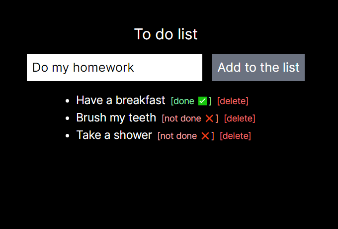
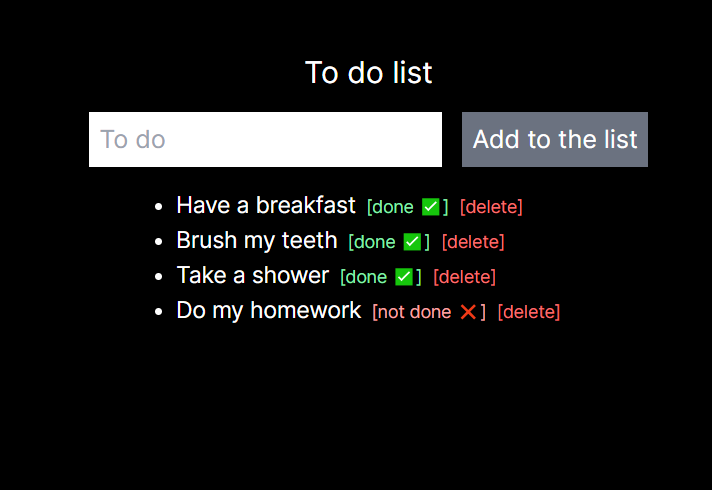

This is a [Next.js](https://nextjs.org/) project bootstrapped with [`create-next-app`](https://github.com/vercel/next.js/tree/canary/packages/create-next-app).

## What is this?
Reactjs exercise:
Build an application to use as a "to do list".  
It has an input with in a form that interact with the to do list. You can add new tasks through the input, mark it as completed or yet to be done and delete a task from the list.

### Method
Using the <i style="text-decoration: underline">useState</i> from react, you create a list of objects where you can modify the items inside.  
Make a map to pass through the items of the array and manipulate them to be shown as a <i style="text-decoration: underline">list</i>.  
Create any kind of "buttons", giving it an onClick event that execute a function to manipulate the data inside the array, using the map index properly.  
Check the code on <i style="text-decoration: underline">page.tsx</i> for more details on the props and to see how I builded up the functions.

#### Exercise from B7WEB react-JS course

